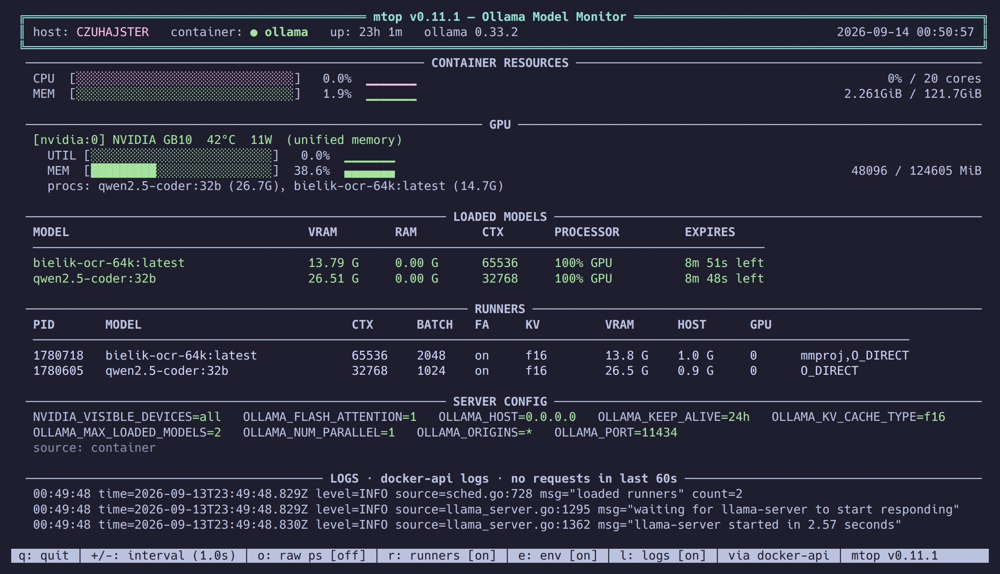

# mtop

**htop for Ollama** — a curses-based TUI that monitors your models, GPU, and the Ollama server (in Docker, Podman *or* bare-metal) in real time. Zero flicker. Zero dependencies beyond Python 3.10+.




## Why?

There are web dashboards, Prometheus exporters, and chat TUIs for Ollama. But there's no **terminal monitor** — something you SSH into a box and just run, like `htop` or `nvtop`, to see what models are loaded, how much VRAM they're eating, and whether the container is healthy.

`mtop` fills that gap. One file, one command, pure stdlib Python. It auto-detects whether Ollama runs in a Docker/Podman container or as a bare-metal process (systemd or a manual `ollama serve`) and monitors it either way.

## Features

- **Zero-flicker display** — curses double-buffered rendering, no `clear` + print loops
- **Effective inference config** — `RUNNERS` section parses each runner's argv: context, batch, flash attention, KV cache dtype, layer offload. The only place these are observable
- **Whole-tree process stats** — the server *and* its per-model `ollama runner` subprocesses, with PSS accounting where available
- **Server config** — the `OLLAMA_*` / `CUDA_VISIBLE_DEVICES` / `HSA_*` environment the server was started with, from the container, the process, or the systemd unit; next to RUNNERS this is "what was set" vs "what was negotiated"
- **Which model on which card** — NVIDIA per-process VRAM via NVML (ctypes, no `nvidia-smi` fork) joined to the runner PIDs: a `GPU` column in RUNNERS and a `procs:` line under each card
- **Loaded models** — name, VRAM/RAM split, context length, processor type, TTL countdown
- **Container health** — status indicator (●/✗/○), uptime, CPU & memory with progress bars
- **Multi-vendor GPU monitoring** — NVIDIA via NVML (`nvidia-smi` as fallback), AMD and Intel via sysfs, Apple Silicon via `ioreg`; side by side on the same host; utilization, VRAM/GTT, temperature, power draw
- **AMD without ROCm** — telemetry comes from `/sys/class/drm/card*/device`, so a bare `amdgpu` driver is enough; `rocm-smi` is only a fallback
- **Jetson / Tegra / NVIDIA Spark** — automatic fallback to unified memory via `/proc/meminfo`
- **Non-blocking UI** — all I/O (docker, nvidia-smi, HTTP) runs in a background collector thread; the interface stays responsive at 100 ms even when the API hangs, and stale data is flagged
- **Interactive** — `q` to quit, `+`/`-` to adjust refresh interval, `o` to toggle raw `ollama ps`
- **Log panel with request stats** — tail of the container log or `journalctl`, with requests/minute, status classes and p50 latency parsed from Ollama's GIN access log (`l` to toggle, `--logs`)
- **Sparklines** — CPU, MEM, GPU utilization and VRAM history next to each bar, block characters, stdlib `deque`
- **Scriptable** — `--json` one-shot mode for cron or Ansible facts (exit code 1 on unhealthy); `--json --watch` streams NDJSON
- **Prometheus exporter without a port** — `--prometheus` prints text exposition format; `--prometheus --watch -o …/textfile/mtop.prom` keeps a node_exporter textfile fresh with atomic writes, no cron needed
- **API-only mode** — `--no-docker` for monitoring remote Ollama instances without local docker calls
- **cgroup-aware CPU bar** — normalizes against the container's `--cpus`/quota limit, not the host core count
- **Docker *and* bare-metal** — auto-detects the source: a Docker container, a systemd `ollama.service`, or a manual `ollama serve`; monitors process CPU/MEM via `/proc` (Linux, no root) or `ps`/`sysctl` (macOS)
- **Docker Engine API over the socket** — no `docker` binary needed: mtop talks to `/var/run/docker.sock` (or a rootless / Podman socket, or `$DOCKER_HOST`) with stdlib `http.client`; the `docker`/`podman` CLI is only a fallback. One-shot stats mean no 2 s `docker stats` stall per cycle
- **Podman** — same code path via the compat API socket or the `podman` CLI
- **Respects `$OLLAMA_HOST`** — works with remote Ollama instances out of the box
- **Several instances at once** — repeat `-u`; each remote gets its own LOADED MODELS table. Two Ollama instances on a mixed CUDA + ROCm host, or a fleet of remote boxes, on one screen
- **Behind a reverse proxy** — `-H 'Authorization: Bearer …'`, `$OLLAMA_API_KEY`, basic auth in the URL, `--insecure` / `--cacert` for private certificates
- **Zero external dependencies** — only Python stdlib (`curses`, `urllib`, `json`, `subprocess`)

## Quick Start

### One-liner (no install)

```bash
curl -fsSL https://github.com/Quaerendir/mtop/releases/latest/download/mtop.py -o mtop.py
chmod +x mtop.py
./mtop.py
```

### pip install

> Not yet published to PyPI — coming with the first tagged release. Until then, use the one-liner or install from source.

```bash
pip install ollama-mtop   # (pending)
mtop
```

### From source

```bash
git clone https://github.com/Quaerendir/mtop.git
cd mtop
pip install -e .
mtop
```

### Run directly from a clone (no install)

```bash
git clone https://github.com/Quaerendir/mtop.git
cd mtop
PYTHONPATH=src python -m mtop
```

## Usage

```
mtop [-c CONTAINER] [-i INTERVAL] [-u URL ...] [-H HEADER] [--insecure] [--cacert FILE]
     [-m MODE] [--runtime RT] [--no-gpu] [--json | --prometheus] [--watch] [-o FILE] [-V] [-h]

Options:
  -c, --container NAME   Docker container name (default: ollama)
  -m, --mode MODE        Data source: auto|docker|local|api (default: auto)
                         local = bare-metal `ollama serve` (systemd/proc/ps)
                         api   = models only, no host resource stats
  -i, --interval SECS    Refresh interval in seconds (default: 1.0)
  -u, --api-url URL      Ollama API base URL (default: $OLLAMA_HOST or http://localhost:11434)
                         Scheme-less values (gpu-rig:11434) are accepted, like Ollama itself.
                         Repeatable: the first is the primary (host stats, runners), the
                         rest are API-only. Optional label: -u rig=http://gpu-rig:11434.
                         Credentials in the URL (https://user:pw@host) become basic auth.
  -H, --header 'N: v'    Extra HTTP header for every API request (repeatable);
                         $OLLAMA_API_KEY is sent as 'Authorization: Bearer …' automatically
      --insecure         Skip TLS certificate verification for https:// endpoints
      --cacert FILE      CA bundle (PEM) to verify https:// endpoints against
      --runtime RT       How to reach the container runtime: auto|api|cli (default: auto)
                         api = Engine API on $DOCKER_HOST or a docker/podman socket
                         cli = docker/podman subprocesses
      --no-gpu           Disable GPU monitoring section
      --no-runners       Hide the RUNNERS section (effective inference config)
      --no-env           Hide the SERVER CONFIG section (OLLAMA_* environment)
      --logs             Show the LOGS section from the start (toggle with l); adds
                         `logs` with request stats to --json / --prometheus
      --log-lines N      Log lines to show (default: 8)
      --no-docker        API-only mode: skip all docker calls (remote instances)
      --json             Print one snapshot as JSON and exit (exit 1 on unhealthy)
      --prometheus       Print one snapshot in Prometheus text exposition format and exit
      --watch            With --json/--prometheus: emit every INTERVAL seconds until Ctrl-C
                         (--json --watch prints NDJSON, one compact object per line)
  -o, --output FILE      Write to FILE instead of stdout: Prometheus output replaces the file
                         atomically (tmp + rename), NDJSON is appended
  -V, --version          Show version
  -h, --help             Show help
```

### Examples

```bash
# Monitor a custom container name
mtop -c my-ollama

# Slower refresh for remote/metered connections
mtop -i 5

# Bare-metal Ollama (systemd service or `ollama serve` in a terminal)
mtop --mode local

# Let mtop figure it out (docker? systemd? manual? — it probes in that order)
mtop

# Monitor a remote Ollama instance — API only, no local docker/GPU noise
mtop -u 192.168.1.100:11434 --mode api

# Several instances: the local one with full host stats, two remotes API-only
mtop -u localhost:11434 -u rig=gpu-rig:11434 -u spark=192.168.3.6:11434

# Ollama behind a reverse proxy with a private CA and a bearer token
OLLAMA_API_KEY=… mtop -u https://ollama.internal --cacert /etc/ssl/internal-ca.pem

# Podman (rootless): the socket is found automatically; or point at it
DOCKER_HOST=unix://$XDG_RUNTIME_DIR/podman/podman.sock mtop

# mtop inside a container, with only the socket mounted — no docker CLI needed
docker run --rm -it -v /var/run/docker.sock:/var/run/docker.sock \
  --network host python:3.12-slim sh -c \
  "curl -fsSL https://github.com/Quaerendir/mtop/releases/latest/download/mtop.py -o m.py && python m.py"

# One-shot health/state snapshot for scripting (schema_version=1 is the first key;
# it changes only when a field changes meaning or goes away)
mtop --json | jq '.models[].name'

# Stream one JSON line per second (NDJSON) — feed it to jq, a log shipper, or a file
mtop --json --watch -i 1 | jq -c '{t: .wallclock, models: [.models[].name]}'

# Prometheus, no port: keep a node_exporter textfile fresh (atomic writes)
mtop --prometheus --watch -i 15 -o /var/lib/node_exporter/textfile_collector/mtop.prom

# Using OLLAMA_HOST environment variable
export OLLAMA_HOST=http://gpu-rig:11434
mtop
```

### Interactive Keys

| Key | Action |
|-----|--------|
| `q` / `ESC` | Quit |
| `+` | Decrease refresh interval (faster) |
| `-` | Increase refresh interval (slower) |
| `o` | Toggle raw `ollama ps` section |
| `r` | Toggle the `RUNNERS` section |
| `e` | Toggle the `SERVER CONFIG` section |
| `l` | Toggle the `LOGS` section (container logs / journalctl, request stats) |

## What you see

The screenshot above is a real session on a DGX Spark (GB10) with Ollama in Docker and two models loaded. Top to bottom:

- **header** — host, container (or `ollama: serve · pid`, or the API URL in api mode), uptime, the Ollama version, and `+N endpoints` when several are polled; `STALE` appears if the collector falls behind
- **CONTAINER / PROCESS RESOURCES** — CPU normalized to the cgroup / systemd / affinity budget, memory with the accounting named (`pss`, `rss` or cgroup), sparklines of the recent history
- **GPU** — one block per card, any vendor; `procs:` lists what NVML sees on the card, joined to the runners by PID
- **LOADED MODELS** — `/api/ps`, one table per endpoint when there are several; PROCESSOR computed exactly as `ollama ps` does
- **RUNNERS** — the negotiated inference config from each runner's argv, plus the card it sits on
- **SERVER CONFIG** — the `OLLAMA_*` environment the server was started with and where it was read from
- **LOGS** — tail of the container log or journal, with request rate and latency parsed from the GIN access log
- **footer** — keys, the container runtime in use (`via docker-api`), version

`o` adds the raw `ollama ps` table. Refresh the screenshot with `tools/screenshot.py` (see its docstring).

## Supported Platforms

| Platform | GPU Monitoring | Notes |
|----------|---------------|-------|
| Linux x86_64 + NVIDIA | ✅ Full | NVML via ctypes; `nvidia-smi` on host or in container as fallback |
| NVIDIA Jetson / Orin | ✅ Unified memory | Falls back to `/proc/meminfo` |
| NVIDIA GB10 Spark | ✅ Unified memory | Tegra-based, same fallback |
| Linux + AMD (amdgpu) | ✅ Full | sysfs — no ROCm install required |
| AMD APU (780M, Strix) | ✅ Unified memory | GTT pool, not the tiny VRAM carve-out |
| Linux + Intel (Arc / Xe / iGPU) | ⚠️ Partial, untested | sysfs: name, VRAM total (xe), temperature, power, frequency; no utilization without root |
| Linux without GPU | ✅ (no GPU section) | Use `--no-gpu` to hide the section |
| Ollama in Podman | ✅ Full | compat API on the Podman socket, or the `podman` CLI |
| Bare-metal Ollama (systemd) | ✅ process stats | `--mode local`; CPU/MEM from `/proc`, no root needed |
| Manual `ollama serve` | ✅ process stats | auto-detected via `/proc` cmdline scan |
| macOS (Apple Silicon) | ✅ Unified memory (no temp/power) | Verified on M5 Pro, macOS 26.6: GPU utilization and in-use memory via `ioreg`, no root; `--mode local` process stats via `ps`/`sysctl`; temperature/power need root (`powermetrics`) |
| WSL2 | ⚠️ Partial | Works if Docker + nvidia-container-toolkit configured |

## Requirements

- **Python 3.10+** (uses `match`-era type hints like `list[str]`, `X | Y`)
- **Docker or Podman** for container monitoring — access to the socket is enough, the CLI is optional
- **Ollama** in a container, as a bare-metal process, or reachable via API
- **NVIDIA driver** (optional, for GPU stats — `libnvidia-ml.so.1`, or `nvidia-smi` as fallback)

## Roadmap

- [ ] Record terminal sessions with `asciinema` for README gif
- [x] AMD GPU support (sysfs first, `rocm-smi` fallback)
- [x] Apple Silicon GPU stats (via `ioreg`, no root — `powermetrics` needs sudo)
- [x] Intel GPU stats via sysfs (partial: no utilization without CAP_PERFMON)
- [ ] Model pull progress tracking
- [x] Multi-host support (repeatable `-u`, per-endpoint model tables)
- [x] Docker Engine API over the socket, Podman support
- [x] Configurable layout (raw `ollama ps` toggle; more sections to follow)
- [ ] Model actions — unload on keypress (`keep_alive: 0`), extend TTL
- [x] Sparkline history for CPU/GPU utilization (block chars, stdlib deque)
- [x] systemd/bare-metal Ollama support (process stats via `/proc`, no Docker required)
- [x] Log panel (container logs / journalctl) with request stats from the GIN log
- [x] Effective inference config per runner (context, flash attention, KV dtype)
- [x] Prometheus text exposition (`--prometheus`) and NDJSON streaming (`--watch`)
- [x] Request rate from the access log (tokens/s is per-response data Ollama returns only to the caller — not observable from outside)
- [x] Effective server environment (`OLLAMA_*`) per source
- [x] Runner → GPU mapping via NVML per-process memory

## Contributing

PRs welcome. Keep it stdlib-only — the zero-dependency constraint is a feature, not a limitation.

```bash
git clone https://github.com/Quaerendir/mtop.git
cd mtop
pip install -e ".[dev]"      # + pytest, ruff
# hack on src/mtop/*.py — util, procfs, runner, collector, ui, cli, container, gpu, logs, export
mtop

ruff check src tools tests
pytest                       # stdlib-only fakes: no GPU, docker or Ollama needed

# regenerate the single-file artifact shipped with releases
python tools/bundle.py       # -> dist/mtop.py
```

`dist/mtop.py` is generated — never edit it by hand. The version lives in `src/mtop/_version.py` only. CI builds it on every
push and attaches it to the GitHub release when a `v*` tag is pushed.

## License

MIT — see [LICENSE](LICENSE).

## Acknowledgements

Built as a collaboration between a human homelab geek and Claude (Anthropic) during a late-night infrastructure session. The original bash prototype migrated to Python/curses because fighting `tput` and `jq` in a loop was getting old.
